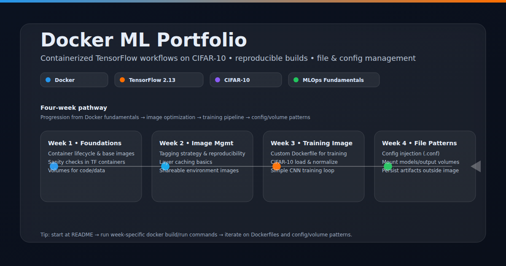
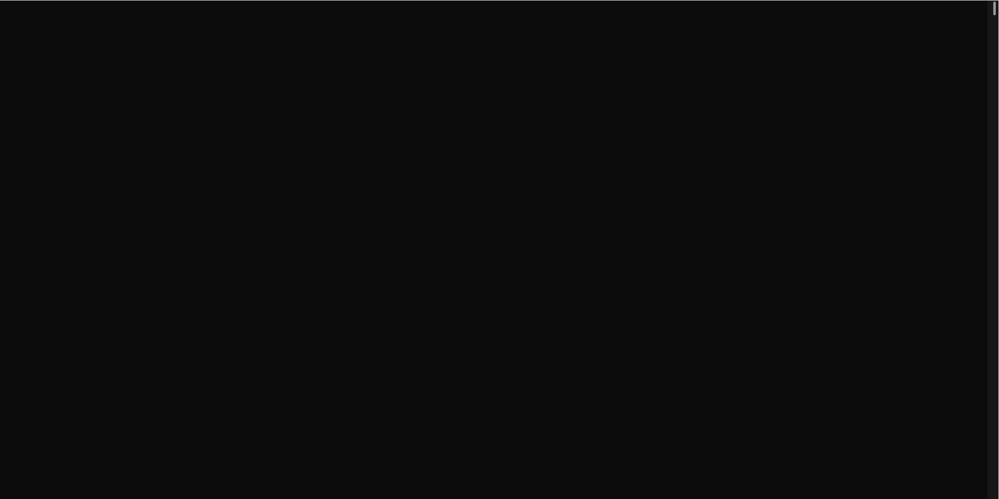
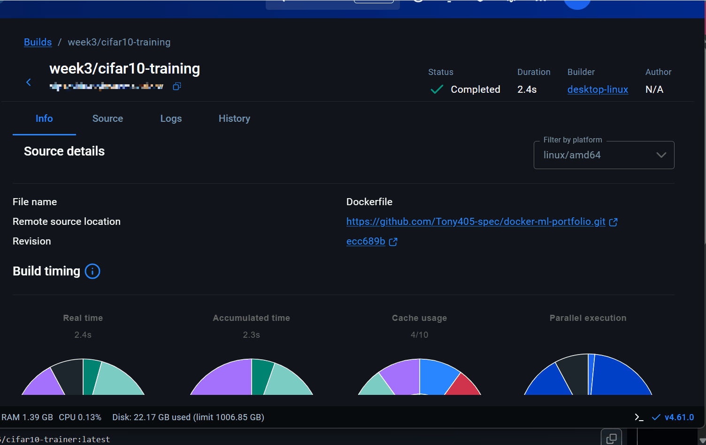

---

# **`Docker ML Portfolio: Containerized Machine Learning Workflows`**

**Docker • TensorFlow • CIFAR-10 • MLOps Fundamentals**

A structured four-week learning repository demonstrating containerization best practices for machine learning workloads. Implements reproducible training environments, image optimization strategies, and containerized file management patterns using TensorFlow and the CIFAR-10 dataset.




---

## **`Live Demo`**

<p align="center">
  
</p>

### ***`Results`***

<p align="center">
  
</p>

*Comprehensive walkthrough of containerized ML workflows including detached execution, inline TensorFlow validation, and training pipeline orchestration.*

---

## Strategic Objective

Machine learning reproducibility requires standardized execution environments. This repository documents a systematic four-week progression from Docker fundamentals to production-ready containerized training pipelines. Each week builds incrementally toward a complete MLOps workflow: image optimization, dependency management, volume mounting, and configuration-driven training execution.

---

## Learning Pathway

| Week | Focus Area | Key Artifacts | Learning Outcomes |
|------|------------|---------------|-------------------|
| **Week 1** | Docker fundamentals recap | `WEEK1_SUMMARY.md` | Container lifecycle, base images, basic commands |
| **Week 2** | Image management & tagging | `week2/` | Multi-stage builds, layer optimization, tagging strategy |
| **Week 3** | CIFAR-10 training pipeline | `week3/cifar10-training/` | TensorFlow containerization, training reproducibility |
| **Week 4** | File management patterns | `week4/file-management/` | Volume mounting, configuration injection, data persistence |

---

## Repository Architecture

```
docker-ml-portfolio/
├── README.md
├── requirements.txt
├── test_tf.py
├── test_cifar10.py
├── WEEK1_SUMMARY.md
├── week2/
│   └── TAGGING_STRATEGY.md
├── week3/
│   └── cifar10-training/
│       ├── Dockerfile
│       ├── train.py
│       └── requirements.txt
├── week4/
│   └── file-management/
│       └── cifar10-file-management/
│           ├── Dockerfile
│           ├── scripts/
│           │   └── train_with_config.py
│           └── configs/
└── assets/
    └── Docker.gif
```

---

## Execution Workflow

| Step | Action | Command / Location |
|------|--------|--------------------|
| **1** | Select target week | Week 1–4 per above specification |
| **2** | Initialize Python environment (optional) | `python -m venv .venv && source .venv/bin/activate` |
| **3** | Install local dependencies | `pip install -r requirements.txt` |
| **4** | Run validation checks | `python test_tf.py` and `python test_cifar10.py` |
| **5** | Build container image | See per-week build commands below |
| **6** | Execute containerized training | See per-week run commands below |
| **7** | Document outcomes | Update respective `WEEK*_SUMMARY.md` |

---

## Container Build & Execution Commands

### Week 3: CIFAR-10 Training Pipeline

| Operation | Command |
|-----------|---------|
| **Build** | `cd week3/cifar10-training && docker build -t cifar10-trainer:local .` |
| **Run** | `docker run --rm cifar10-trainer:local python train.py --epochs 1` |

### Week 4: File Management with Configuration Injection

| Operation | Command |
|-----------|---------|
| **Build** | `cd week4/file-management/cifar10-file-management && docker build -t cifar10-file-mgmt:local .` |
| **Run** | `docker run --rm cifar10-file-mgmt:local python scripts/train_with_config.py` |

### Detached Container Execution (Demonstrated)

| Operation | Command |
|-----------|---------|
| **Launch background container** | `docker run -d --name tf-background tensorflow/tensorflow:2.13.0 sleep 300` |
| **Execute inline command** | `docker exec tf-background python -c "import tensorflow as tf; print(tf.__version__)"` |

---

## Validation Suite

| Script | Purpose |
|--------|---------|
| `test_tf.py` | TensorFlow installation verification and version confirmation |
| `test_cifar10.py` | CIFAR-10 dataset accessibility and integrity check |

Run both scripts prior to containerization to confirm baseline environment functionality.

---

## Image Tagging Strategy

Refer to `week2/TAGGING_STRATEGY.md` for comprehensive documentation on:

| Tagging Pattern | Use Case |
|-----------------|----------|
| `:local` | Development and local testing builds |
| `:latest` | Most recent stable version |
| `:v{major}.{minor}.{patch}` | Semantic versioned releases |
| `:{timestamp}` | Experimental or ephemeral builds |

---

## Container Run Modes Summary

| Mode | Flag | Use Case |
|------|------|----------|
| **Foreground** | (default) | Interactive debugging, log streaming |
| **Detached** | `-d` | Long-running training, background services |
| **Interactive** | `-it` | Shell access inside container |
| **One-off** | `--rm` | Ephemeral training runs, automatic cleanup |

---

## Technical Prerequisites

| Requirement | Minimum Version |
|-------------|-----------------|
| Docker Engine | 20.10+ |
| Python | 3.9+ (for local validation only) |
| TensorFlow | 2.13.0 (container-managed) |
| CUDA (optional) | 11.8+ for GPU acceleration |

---

## Key Learning Outcomes

| Week | Technical Mastery |
|------|-------------------|
| 1 | Container lifecycle management, image vs. container distinction |
| 2 | Layer caching optimization, multi-stage builds, registry tagging |
| 3 | Reproducible training environments, dependency pinning |
| 4 | Volume mounting, configuration externalization, data persistence patterns |

---

## Limitations & Future Extensions

| Limitation | Proposed Enhancement |
|------------|----------------------|
| Single-GPU training only | Multi-GPU distributed training support |
| CPU-based default images | CUDA-enabled GPU images with runtime detection |
| Manual configuration files | Environment variable injection with validation |
| No orchestration layer | Docker Compose for multi-container pipelines |
| Local volume only | Cloud storage mounting (S3, GCS) |

---
